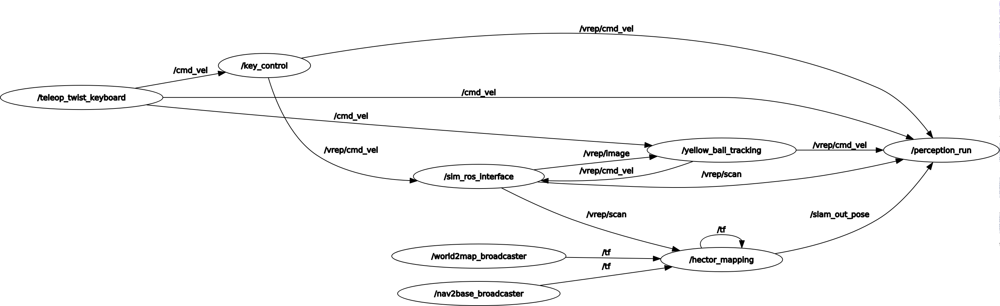
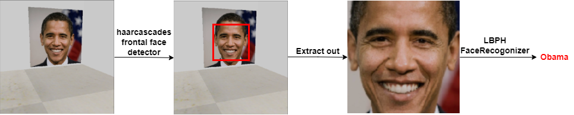
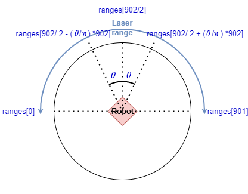
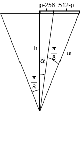
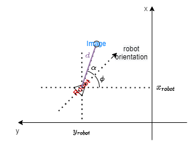
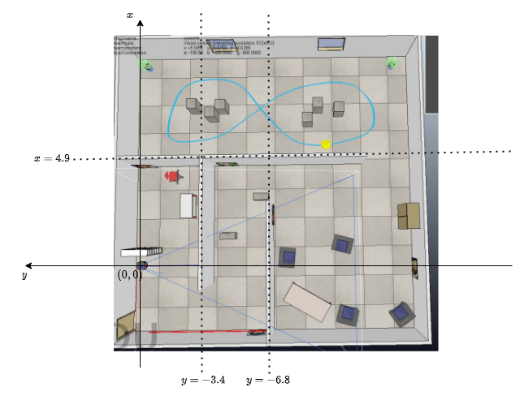
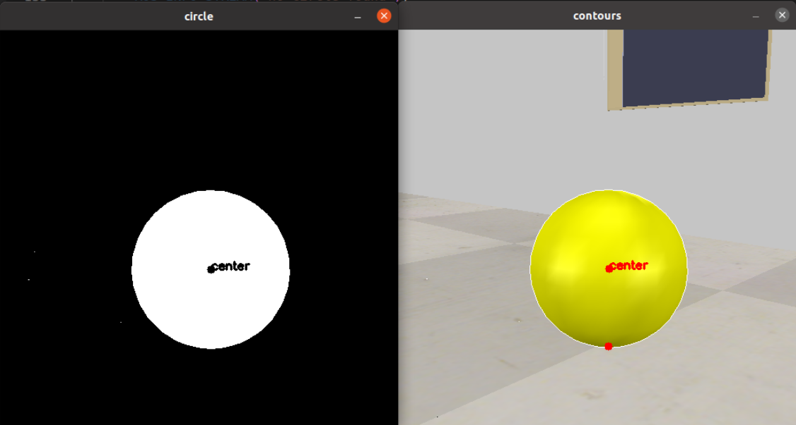
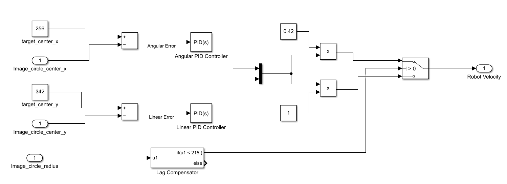

# **ELEC3210 Final Project Report**

CHENG Yize 20760620

ZHAO Yu Xuan 20497819

Demo Video [Link](link of the demo video in youtube)

GitHub Repo [Link](https://github.com/CHENGEZ/ELEC3210_Project)

## **Overview**
In this project, we implemented ROS packages for achieving 5 tasks under a simulation environment. The 5 tasks include controlling the robot using the keyboard, building the map and localizing the position of the robot through simultaneous localization and mapping (SLAM), detecting and localizing images on the wall, judging the area of the robot, and following a moving yellow ball in the environment. We merged the image detection package and the area judging package together to form a `perception` package. Overall, when all tasks are launched, the ROS node graph showing all topic communication between nodes is shown in the following figure.


## **Environment Setup**
- Basic Requirement
    - Ubuntu 20.04
    - ROS Noetic
    - CoppeliaSim 4.4.0
- Extra Packages/Libraries
    - A modified `teleop_twist_keyboard` package.
        - Install the original `teleop_twist_keyboard` package using `sudo apt-get install ros-noetic-teleop-twist-keyboard`
        - Because the original teleop only supports controlling the robot, but we need one additional key to change the control mode (manual/auto) and two additional keys to control whether the camera and laser should be enabled. (We want to disable the laser in auto tracking mode), so we need to modify their source code to add this new feature. 
            - go find the original .py file `teleop_twist_keyboard.py` at `/opt/ros/noetic/lib/teleop_twist_keyboard` (This should be the default directory if you did not modify your default installation directory)
            - replace the original py file `teleop_twist_keyboard.py` with the `teleop_twist_keyboard.py` file we provided in our code submission. Our modified `teleop_twist_keyboard.py` is under `key_ctrl/scripts/`. (You may need sudo access to make this modification on your local computer)
    - The `hector_mapping` package provided by ROS.
        - Install it using `sudo apt-get install ros-noetic-hector-mapping`
    - OpenCV4
        - Note that the installation of OpenCV should also include the pre-trained face detection model `haarcascade_frontalface_default.xml` under `/usr/share/opencv4/haarcascades/`, which should be the default path to find this model. This model is necessary for completing the face recognition task.

    
## **Module Implementation**
### **Keyboard Control** (CHENG Yize)
The keyboard controller leveraged the modified version of the `teleop_twist_keyboard` package from ROS. This package listens to keyboard signals and publish different velocity commands (including linear and angular velocity in the x, y, and z dimension) to the `/cmd_vel` topic according to different keyboard inputs. Since in this project, we only need linear velocity in the x dimension and angular velocity in the z dimension, the remaining four values can be utilized to serve as boolean variables to control the switch of the laser, switch of the camera, and the control mode. We achieved this by adding three boolean data members `self.enable_img`, `self.enable_laser`, and `self.manual_control` to the `PublishThread` class in `teleop_twist_keyboard.py`. We negate the values stored in these three variables when key `s`, `d`, and `t` are pushed, where `s` controls the camera switch, `d` controls the laser switch, and `t` controls the control mode. We use the angular velocity in the x dimension as the boolean indicator of the camera switch, the angular velocity in the y dimension as the boolean indicator as the laser switch, and the linear velocity in the y dimension as the boolean indicator for the control mode. The value of `enable_img` and `enable_laser` are further published to `/vrep/camera_switch` and `/vrep/laser_switch` respectively to control the the camera and laser. And we only further pass on the velocity command from `/cmd_vel` to `/vrep/cmd_vel` to control the robot in the simulation environment if the value of `manual_control` is true, otherwise the velocity command should come from the `follow_yellow_ball` package.

The eventual key control instruction is shown as follows:
- `s` : toggle enable/disable camera
- `d` : toggle enable/disable laser
- `t` : toggle manual/auto mode. The key controls work only in the manual mode. The keys will have no effect to the robot movement under auto mode.
- `u`,`i`,`o`,`j`,`k`,`l`,`m`,`,`,`.` : these 9 keys serves the same purpose as in the original `teleop_twist_keyboard` package. (for moving around)
- `q`/`z` : increase/decrease max speeds (both linear and angular) by 10%
- `w`/`x` : increase/decrease only linear speed by 10%
- `e`/`c` : increase/decrease only angular speed by 10%

### **Build Map** (CHENG Yize & ZHAO Yu Xuan)
The `build_map` package leveraged the `hector_mapping` package provided by ROS. We only need to write a launch file to pass the required parameters to the package, and the package can produce a decent SLAM result as long as we do not input an angular velocity that is too high. Also, because we only have the `map_frame` and `base_frame` but not the odometry frame `odom_frame` of the robot, we simply pass `base_link` into both the `base_frame` and `odom_frame`. This package does not require the odometry of the robot to build the map. It publishes the map information through the `/map` topic and the map can be visualized in rviz. Also, we added the rviz node into the launch file of this package to pop up our customized configured rviz canvas, which shows the map, marker, and robot position, once the program is launched. The configuration is saved in `build_map/rviz/rviz.rviz`.

### **Perception** (CHENG Yize)
The Perception package is responsible for both the image detection and localization task and the area judging task. 
- **Image detection and localization**

    - **Detection**
    
        We want to both detect the existence of one of the five given face images in the view, and also to classify which face is in the current view. The overall idea is to first detect general "faces" in the image (since all 5 images are faces), and then extract out the face area detected from the face detector into a separate classifier to determine exactly which face it is. To detect the faces, we utilized the `haarcascades` from opencv, specifically, the `haarcascade_frontalface_default.xml` model. This model uses a sliding-window approach to detect faces in an image, and hence, one important parameter for this model is `num_of_neighbors`, which is the value used to determine how many neighbors each candidate rectangle should have to retain it. This value defines a size for the "neighborhood of rectangles". A proposed rectangle is retained only if it lies within a neighborhood that is big enough (have at least `num_of_neighbors` many rectangles). Intuitively, the larger this value is, the stricter it is for a positive box to be produced in the output. After some experiments, we discovered that setting `num_of_neighbors` as 6 can produce a decent result with very few false positive output. Then, the detected face area is extracted out from the image and passed to a separate classifier for further classification. For the classifier, we used `LBPHFaceRecognizer` provided by OpenCV. We first prepared a small training dataset containing 15 images (5 image for each face), and wrote a separate source file `perception_train.cpp` to train the classifier and save the model in `perception/model.xml`. Then when the extracted face is passed into this pre-trained classifier, it can correctly output which face is in the input. An example of this idea is illustrated using the example of the 'obama' image as below:

        
        
    - **Marking the position of images**

        The goal is to map the (x,y) coordinate of the detected face image in the map built by the `build_map` package. The main idea is to estimate the position of the image using the position of the robot itself in addition with an offset value calculated from the information both from the input image and the laser scan data. The position of the robot itself can be easily obtained from the `/slam_out_pose` published by the `build_map` package. The published message is of type `geometry_msgs::PoseStamped`, which include the `Pose` element that include both the (x,y,z) position of the robot, and also the rotation of the robot expressed in quaternion. The core part is to calculate the offset value between the robot position and the image position. We form this as a simple plane geometry problem. The offset value can be calculated using two values: 
        1. the distance $d$ between the robot and the image;
        2. the angle between the orientation of the robot and the connection between the robot and the image $\alpha$;
        
        We make use of the `ranges` obtained from the laser scan data to obtain $d$. The `ranges` field of the laser scan data is an array of length 902 returning the distances between the robot and the obstacles in 902 different directions. If we define the orientation direction of the robot to be $\frac{\pi}{2}$, The laser scans all directions from $0$ to $\pi$ and keeps the distances in the array `ranges`. It's obvious that we can get the distance between the robot and the obstacle in direction $\theta$ (relative to the robot's orientation) from `ranges` by indexing at $\frac{902}{2} \pm \frac{\theta}{\pi}\times 902$, where we "$+$" if the direction is towards the right of the robot orientation, and "$-$" if the direction is towards the left of the robot orientation. An illustration of this idea is shown in the following figure. 
        
        

        After obtaining the distance $d$ between the robot and the image, we only need the angle between the orientation of the robot and the connection between the robot and the image $\alpha$. This can be obtained from the input image from the camera. Recall that we boxed the detected face in the image, and we also know the full size of the camera out put is $512\times 512$ and the perspective angle of the camera is 45 degrees ($\frac{\pi}{4}$). Therefore, suppose the x coordinate value of the center of the extracted face in the camera output image is $p$, we can calculate the relative angle between the orientation of the robot and the connection between the robot and the center of the face as follows:

        

        $$\tan(\frac{\pi}{8})=\frac{256}{h}$$
        $$h=\frac{256}{\tan(\frac{\pi}{8})}$$
        $$ \tan(\alpha)= \frac{p-256}{h}=\frac{(p-256)\cdot \tan(\frac{\pi}{8})}{256}$$
        $$ \therefore \alpha=\arctan(\frac{(p-256)\cdot \tan(\frac{\pi}{8})}{256}) $$

        With the distance $d$ and the relative angle $\alpha$, we can now calculate the position coordinate from the robot position with a little help of the robot orientation obtained from the quaternion expression of the pose of the robot. A quaternion is expressed in the form of $(w,x,y,z)$, where $x=RotationAxis.x \times \sin(\frac{angle}{2})$, $y=RotationAxis.y \times \sin(\frac{angle}{2})$, $z=RotationAxis.z \times \sin(\frac{angle}{2})$, and $w=\cos(\frac{angle}{2})$. In our case, the robot may only rotate along the $z$ dimension, so both $x$ and $y$ are always 0. We may obtain the rotation angle $\phi$ from $w$, where $\phi=2\times \arccos(w)$. With all of the above information we can now calculate the position of the image. An example is shown in the following image.

        

        In this example, the image position can be obtained as follows:
        $$x_{img}=x_{robot}+d \cdot \cos(\alpha+\phi)$$
        $$y_{img}=y_{robot}-d \cdot \sin(\alpha+\phi)$$


- **Area judging**

    Since we already obtained the robot position $(x_{robot},y_{robot})$ when marking the image position, it is very natural to judge the area in which the robot is located from the robot position here in the same node. The basic idea is to match the robot position to the area directly. After running several experiments, we found the following parameters of the environments.

    

    By comparing the robot coordinate values with these map area boundary values, we can determine the area in which the robot is located.
- **User Interface**

    We form our user interface in the perception package, because a lot of important information was either produced in this package or was used in this package by subscribing relevant topics, including the face detection result, the robot position, the linear and angular speed, the area judgement result, the camera and laser switch, and the control mode. This interface will serve as a simple display panel to display the camera output image and the above mentioned information in an OpenCV window.

### **Follow Yellow Ball** (ZHAO Yu Xuan)
To achieve the task of autonomously tracking the yellow ball, we firstly divide it into two major sub tasks which are yellow ball extraction and control of the robot respectively.
- **Yellow Ball Extraction**

    Thanks to the CV bridge package, we could easily convert the ROS camera image to the OpenCV Mat image. Then we used several functions API from OpenCV to get the masked image.

    ```C++
    // masked image to show the yellow ball
    Mat original_image = cv_image->image;
    flip(original_image, original_image, 1);
    Mat hsv;
    cvtColor(original_image, hsv, COLOR_BGR2HSV);
    Scalar yellow_lower_bound = Scalar(26, 43, 46);
    Scalar yellow_upper_bound = Scalar(34, 255, 255);
    Mat masked_image;
    inRange(hsv, yellow_lower_bound, yellow_upper_bound, masked_image);
    ```
    
     From the masked image, the contour could be easily found since the yellow color is filtered out. Then the `number of edges` for each contour could further determine whether the contour represents the shape of a circle. If the circle is found, the `fit_Ellipse` function will help to calculate the center and the radius of the circle. The right window of the [picture](#circle_extratcion) below shows a result of correct extraction of the circle information because the center and a point on the circle could be correctly marked.

    

- **Control Logic**

    With the processed information from the section `yellow ball extraction`, the center of the circle in the image could be corrected to a target location we desired by two `PID` controllers. Two `PID` controllers take responsibility for the linear and angular velocity of the robot to track the yellow ball. As the robot might start to track with a lond distance between the ball and itself, we decide to add a lag compensator to amplify the magnitude of the `PID` controllers' velocity output. And the compensator is only enabled when the radius is not big enough than we expected. So the [picture](#control) below shows the whole control block diagram of our idea.

    

    The tuning of the parameters for the two `PID` controller 
    By taking the leverage of the rqt plot plugin, two topics are created to publish the message of the linear and angular error. Hence we could visualize the performance of the set of the parameters. After fine tuning, both error could achieve almost zero value for most of the tracking time. The set of parameters is shown below.
   
    |PID Parameters|Kp|Ki|Kd|
    |:-------|:----:|:----:|:----:|
    |Linear PID Controller|0.016|0.000|0.020|
    |Angular PID Controller|0.025|0.000|0.020|


### **Launch File** (CHENG Yize & ZHAO Yu Xuan)
We wrote one launch file for each package separately, where the launch file for the keyboard controller launches both the `teleop_twist_keyboard` package and the `key_ctrl` node, the launch file for the `build_map` package launches both rviz and the `hector_mapping` package, the launch file for the `perception` package launches the `perception_run` node, and the launch file for the `follow_yellow_ball` package launch the `follow_yellow_ball` node. The main launch file `main.launch`, which is the only launch file we need to run to start the program, includes all other launch files and launch all packages at the same time.

## **Conclusion**
- **Motivation and Application**
    - This project covers many basic tasks that a real life autonomous robot may actually encounter. It serves as a good simulation and testing method for testing different perception and control algorithms before applying them on real life robots. 
- **Limitation**
    - Currently the SLAM package that we use, `hector_mapping`, did not take in any odometry input. So when the angular velocity is too big, the map building process will fail.
    - Because we update our display panel (user interface) in the image callback function, the window can only be updated when there is image information subscribed. In other words, if the camera is switched off, the text information will no longer be updated until the camera is tuned on again. This may affect the user experience.
    - We could only enable the `auto tracking module` when the camera sensor could capture the whole contour of the yellow ball. Otherwise, our package would not work in a normal way. 
- **Future Work**
    - We may try to conduct experiments to obtain the odometry information of the robot so that we can obtain a more robust SLAM result.
    - We may setup our user interface in another callback function that will always be executed (the image callback function will not be executed when the camera is off). 
    - We may try to find another way for the robot to achieve the task of the autonomous tracking even though the yellow ball could not be captured by the camera for enabling timestamp.


## **References**
- `teleop_twist_keyboard`: http://wiki.ros.org/teleop_twist_keyboard
- `hector_mapping`: http://wiki.ros.org/hector_mapping
- cv_bridge: http://wiki.ros.org/cv_bridge
- `OpenCV`: https://opencv.org/'
- `OpenCV Image Processing`: https://docs.opencv.org/4.x/d2/d96/tutorial_py_table_of_contents_imgproc.html
- `haarcascade_frontalface_default` (face detection model/CascadeClassifier): https://docs.opencv.org/3.4/d1/de5/classcv_1_1CascadeClassifier.html
- `LBPHFaceRecognizer`: https://docs.opencv.org/4.x/df/d25/classcv_1_1face_1_1LBPHFaceRecognizer.html
